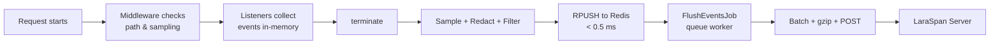

# LaraSpan Client

Monitoring client for Laravel applications. Collects exceptions, requests, queries, jobs, and more, then sends them to your self-hosted [LaraSpan](https://github.com/Laraspan) server.

## Requirements

- PHP 8.2+
- Laravel 11, 12, or 13
- Redis (recommended for queue transport)

## Quick start

```bash
composer require laraspan/client
php artisan laraspan:install
```

Add your credentials to `.env`:

```env
LARASPAN_TOKEN=your-app-api-token
LARASPAN_URL=https://laraspan.yourdomain.com
```

Verify the connection:

```bash
php artisan laraspan:test
```

Get your API token from the LaraSpan dashboard under **Applications > New Application**.

## How it works



- **Zero response-time impact.** Only a sub-millisecond Redis write on terminate.
- **Efficient batching.** One HTTP call handles events from hundreds of requests.
- **No extra processes.** Uses your existing queue workers.
- **Works everywhere.** PHP-FPM, Octane, queue workers, CLI commands.

## What gets monitored

| Monitor | Captures |
|---------|----------|
| Exceptions | Class, message, stack trace, source code context, fingerprint for deduplication |
| Requests | Route, method, status, duration, memory, query count, N+1 detection |
| Queries | SQL (normalized), duration, connection, slow query flagging, bindings (opt-in) |
| Jobs | Class, queue, attempt, duration, memory, status, failure details |
| Scheduler | Command, duration, exit code |
| Cache | Key, operation (hit/miss/write/forget), store, tags |
| Mail | Subject, recipients, sender, duration |
| Notifications | Channel, notifiable type/id, notification class |
| HTTP Client | Method, URL, host, status, duration, slow flagging |
| Commands | Artisan command name, exit code, duration |
| Logs | Level, message (2 000 char max), context (20 entries max) |

Every monitor can be toggled individually. See [Monitors](#monitors) below.

## Configuration

All configuration lives in `config/laraspan.php`, published during install.

### Enable / disable

```env
LARASPAN_ENABLED=false
```

Set to `false` to disable all monitoring without removing the package.

### Transport

```env
LARASPAN_TRANSPORT=queue
```

| Transport | How it works | Overhead | Requirements |
|-----------|-------------|----------|--------------|
| `queue` (default) | Events buffered in Redis, flushed by a background job | < 0.5 ms | Redis, queue worker |
| `inline` | Events sent via HTTP on request terminate | 5-50 ms | None beyond Guzzle |

### Monitors

```php
// config/laraspan.php
'monitors' => [
    'exceptions'   => true,
    'requests'     => true,
    'queries'      => true,
    'jobs'         => true,
    'scheduler'    => true,
    'cache'        => true,
    'mail'         => true,
    'notification' => true,
    'http_client'  => true,
    'command'      => true,
    'log'          => true,
],
```

Each monitor can also be toggled via environment variable, e.g. `LARASPAN_MONITOR_QUERIES=false`.

### Buffer tuning

```php
'buffer' => [
    'flush_threshold'        => 100,   // dispatch flush job after N events in Redis
    'max_batch_size'         => 500,   // max events per HTTP POST
    'max_events_per_request' => 5000,  // safety cap per single request
],
```

### Performance thresholds

```php
'thresholds' => [
    'slow_request_ms'      => 1000,  // flag requests slower than 1 s
    'slow_query_ms'        => 100,   // flag queries slower than 100 ms
    'slow_job_ms'          => 5000,  // flag jobs slower than 5 s
    'n_plus_one_threshold' => 5,     // flag after 5 repeated query patterns
],
```

### Sampling

Reduce event volume on high-traffic applications:

```php
'sampling' => [
    'request' => 1.0,   // 1.0 = 100 %, 0.1 = 10 %
    'query'   => 1.0,
    'job'     => 1.0,
    'cache'   => 1.0,
    'mail'    => 1.0,
    // ... per-type rates
],
```

Exceptions are always captured regardless of sampling rate.

#### Per-route sampling

```php
use LaraSpan\Client\Middleware\Sample;

Route::post('/webhooks', WebhookController::class)
    ->middleware(Sample::rate(0.1));   // 10 %

Route::get('/health', HealthController::class)
    ->middleware(Sample::never());    // never sample
```

### Ignored paths

Skip monitoring for specific request paths (health checks, internal endpoints, etc.):

```php
'ignore_paths' => [
    'up',
    'horizon/*',
],
```

### Ignored exceptions

```php
'ignore_exceptions' => [
    \Symfony\Component\HttpKernel\Exception\NotFoundHttpException::class,
    \Illuminate\Auth\AuthenticationException::class,
    \Illuminate\Validation\ValidationException::class,
],
```

### Redaction

Sensitive fields are replaced with `[REDACTED]` before data leaves your application:

```php
'redact' => [
    'password', 'password_confirmation', 'secret', 'token',
    'api_key', 'authorization', 'credit_card', 'card_number',
    'cvv', 'ssn',
],

'redact_headers' => [
    // additional header names to redact
],
```

Matching is recursive and case-insensitive across all nested payloads.

### Capture options

```php
'capture' => [
    'headers'     => false,  // capture request/response headers
    'payload'     => false,  // capture request body
    'source_code' => true,   // capture code context around exceptions
],

'queries' => [
    'capture_bindings' => false,  // capture SQL query bindings
],
```

### Vendor event filtering

By default, events originating from vendor packages (framework internals, third-party packages) are excluded:

```php
'ignore_vendor_events' => true,
```

## Custom event filtering

Register callbacks to reject specific events before they are buffered:

```php
use LaraSpan\Client\Support\EventFilter;

app(EventFilter::class)
    ->rejectQueries(fn (array $event) => str_starts_with($event['sql'], 'PRAGMA'))
    ->rejectJobs(fn (array $event) => $event['job'] === 'App\\Jobs\\Heartbeat')
    ->rejectCacheKeys(fn (array $event) => str_starts_with($event['key'], 'telescope:'))
    ->rejectLogs(fn (array $event) => $event['level'] === 'debug');
```

Available filter methods: `rejectQueries`, `rejectJobs`, `rejectCacheKeys`, `rejectMail`, `rejectNotifications`, `rejectLogs`, `rejectHttpClient`, `rejectCommands`.

## Programmatic control

```php
use LaraSpan\Client\LaraSpan;

// Temporarily pause/resume capture
LaraSpan::pause();
LaraSpan::resume();

// Execute code without capturing
LaraSpan::ignore(function () {
    // this won't be monitored
});

// Override sampling for current request
LaraSpan::sample(0.5);    // 50 %
LaraSpan::dontSample();   // 0 %
```

## Multi-tenant applications

Attach tenant context to all events in the current request:

```php
use LaraSpan\Client\EventBuffer;

app(EventBuffer::class)->setContext([
    'tenant_id'   => $tenant->id,
    'tenant_name' => $tenant->name,
]);
```

Context data is included with every event sent from that request.

## Deployment tracking

Record deployments so LaraSpan can correlate error spikes and performance changes:

```bash
php artisan laraspan:deploy --version=1.2.0
```

The command auto-detects the current git commit and deployer (system user). You can also specify them explicitly:

```bash
php artisan laraspan:deploy --version=1.2.0 --commit=abc1234 --deployer="CI/CD"
```

## Artisan commands

| Command | Description |
|---------|-------------|
| `laraspan:install` | Publish config and add env variables to `.env` |
| `laraspan:test` | Send a test event to verify connectivity |
| `laraspan:flush` | Manually flush buffered events from Redis |
| `laraspan:deploy` | Record a deployment with version, commit, and deployer |

## Octane compatibility

LaraSpan resets its in-memory event buffer on every Octane request, so state never leaks between requests. No additional configuration is needed.

## Self-monitoring protection

When your LaraSpan server is itself a Laravel application using this client, the package detects requests to `/api/ingest` and `/api/deploy` and pauses monitoring to prevent recursive loops.

## Local development

```env
LARASPAN_ENABLED=true
LARASPAN_URL=http://localhost:8000
LARASPAN_TRANSPORT=inline
```

Use `inline` transport during development to avoid needing Redis and a queue worker. Disable entirely with `LARASPAN_ENABLED=false`.

## Environment variables

| Variable | Default | Description |
|----------|---------|-------------|
| `LARASPAN_ENABLED` | `true` | Enable or disable monitoring |
| `LARASPAN_TOKEN` | — | API token from LaraSpan dashboard |
| `LARASPAN_URL` | `http://localhost:8080` | LaraSpan server URL |
| `LARASPAN_TRANSPORT` | `queue` | `queue` or `inline` |
| `LARASPAN_FLUSH_THRESHOLD` | `100` | Events in Redis before dispatching flush job |
| `LARASPAN_MAX_BATCH_SIZE` | `500` | Max events per HTTP POST |
| `LARASPAN_SLOW_REQUEST_MS` | `1000` | Slow request threshold (ms) |
| `LARASPAN_SLOW_QUERY_MS` | `100` | Slow query threshold (ms) |
| `LARASPAN_SLOW_JOB_MS` | `5000` | Slow job threshold (ms) |
| `LARASPAN_N_PLUS_ONE_THRESHOLD` | `5` | N+1 query detection threshold |
| `LARASPAN_CAPTURE_HEADERS` | `false` | Capture request headers |
| `LARASPAN_CAPTURE_PAYLOAD` | `false` | Capture request body |
| `LARASPAN_CAPTURE_SOURCE_CODE` | `true` | Capture code context for exceptions |
| `LARASPAN_CAPTURE_BINDINGS` | `false` | Capture SQL bindings |
| `LARASPAN_IGNORE_VENDOR_EVENTS` | `true` | Exclude vendor package events |

## License

LaraSpan Client is open-sourced software licensed under the [MIT license](LICENSE).
