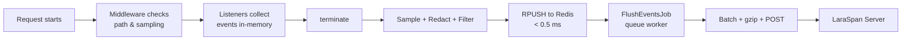

# LaraSpan Client: APM & Error Tracking for Laravel

Monitoring client for Laravel applications. Collects exceptions, requests, queries, jobs, and more, then sends them to your self-hosted [LaraSpan](https://github.com/Laraspan) server.

## Requirements

- PHP 8.2+
- Laravel 11, 12, or 13
- Redis (recommended for queue transport)

## Installation

```bash
composer require laraspan/client
php artisan laraspan:install
```

Add your credentials to `.env`:

```env
LARASPAN_TOKEN=your-app-api-token
LARASPAN_URL=https://laraspan.yourdomain.com
LARASPAN_ENABLED=true
```

Verify the connection:

```bash
php artisan laraspan:test
```

Get your API token from the LaraSpan dashboard under **Applications > New Application**.

## How It Works



- **Zero response-time impact.** Only a sub-millisecond Redis write on terminate.
- **Efficient batching.** One HTTP call handles events from hundreds of requests.
- **No extra processes.** Uses your existing queue workers.
- **Works everywhere.** PHP-FPM, Octane, queue workers, CLI commands.

## What's Monitored

| Monitor | Captures |
|---------|----------|
| **Exceptions** | Class, message, stack trace, source code context, fingerprint for deduplication |
| **Requests** | Route, method, status, duration, memory, query count, N+1 detection, lifecycle stage durations |
| **Queries** | SQL (normalized), duration, connection, slow query flagging, bindings (opt-in) |
| **Jobs** | Class, queue, attempt, duration, memory, status, failure details, parent trace propagation |
| **Commands** | Artisan command name, exit code, duration |
| **Scheduler** | Command, duration, exit code |
| **Cache** | Key, operation (hit/miss/write/forget), store, tags |
| **Mail** | Subject, recipients, sender, duration |
| **Notifications** | Channel, notifiable type/id, notification class |
| **HTTP Client** | Method, URL, host, status, duration, slow flagging |
| **Logs** | Level, message (2,000 char max), context (20 entries max) |

Every monitor can be toggled individually via config or env var (e.g., `LARASPAN_MONITOR_QUERIES=false`).

## Configuration

All configuration lives in `config/laraspan.php`, published during install.

### Transport

```env
LARASPAN_TRANSPORT=queue
```

| Transport | How it works | Overhead | Requirements |
|-----------|-------------|----------|--------------|
| `queue` (default) | Events buffered in Redis, flushed by a background job | < 0.5 ms | Redis, queue worker |
| `inline` | Events sent via HTTP on request terminate | 5-50 ms | None beyond Guzzle |

Additional transport settings:

```php
'redis_connection'  => env('LARASPAN_REDIS_CONNECTION', 'default'),
'transport_timeout' => env('LARASPAN_TRANSPORT_TIMEOUT', 5),
'max_queue_size'    => env('LARASPAN_MAX_QUEUE_SIZE', 50000),
```

### Thresholds

```php
'thresholds' => [
    'slow_request_ms'      => 1000,  // flag requests slower than 1 s
    'slow_query_ms'        => 100,   // flag queries slower than 100 ms
    'slow_job_ms'          => 5000,  // flag jobs slower than 5 s
    'slow_http_client_ms'  => 1000,  // flag HTTP client calls slower than 1 s
    'n_plus_one_threshold' => 5,     // flag after 5 repeated query patterns
],
```

### Buffer Tuning

```php
'buffer' => [
    'flush_threshold'        => 100,   // dispatch flush job after N events in Redis
    'max_batch_size'         => 500,   // max events per HTTP POST
    'max_events_per_request' => 5000,  // safety cap per single request
],
```

### Capture Options

```php
'capture' => [
    'headers'     => false,  // capture request/response headers
    'payload'     => false,  // capture request body
    'source_code' => true,   // capture code context around exceptions
],

'queries' => [
    'capture_bindings' => false,  // capture SQL query bindings
],
```

### Redaction

Sensitive fields are replaced with `[REDACTED]` before data leaves your application. Matching is recursive and case-insensitive across all nested payloads.

```php
'redact' => [
    'password', 'password_confirmation', 'secret', 'token',
    'api_key', 'authorization', 'credit_card', 'card_number',
    'cvv', 'ssn',
],

'redact_headers' => [
    // additional header names beyond the built-in list
],
```

### Ignored Paths

```php
'ignore_paths' => [
    'up',
    'horizon/*',
],
```

### Ignored Exceptions

```php
'ignore_exceptions' => [
    \Symfony\Component\HttpKernel\Exception\NotFoundHttpException::class,
    \Illuminate\Auth\AuthenticationException::class,
    \Illuminate\Validation\ValidationException::class,
],
```

### Vendor Event Filtering

Exclude events originating from vendor packages (framework internals, third-party packages):

```php
'ignore_vendor_events' => true,
```

## Sampling

Reduce event volume on high-traffic applications. Rates range from `0.0` (drop all) to `1.0` (keep all). Exceptions always bypass sampling.

### Global Rates

```php
'sampling' => [
    'request'      => 1.0,
    'query'        => 1.0,
    'job'          => 1.0,
    'scheduler'    => 1.0,
    'cache'        => 1.0,
    'mail'         => 1.0,
    'notification' => 1.0,
    'http_client'  => 1.0,
    'command'      => 1.0,
    'log'          => 1.0,
],
```

Each rate can be set via env var, e.g., `LARASPAN_SAMPLE_REQUEST=0.1`.

### Per-Route Sampling

Use the `Sample` middleware to override the rate for specific routes:

```php
use LaraSpan\Client\Middleware\Sample;

Route::post('/webhooks', WebhookController::class)
    ->middleware(Sample::rate(0.1));   // 10 %

Route::get('/health', HealthController::class)
    ->middleware(Sample::never());    // never sample

Route::get('/checkout', CheckoutController::class)
    ->middleware(Sample::always());   // always sample
```

### Per-Request Sampling

Override sampling programmatically within a request:

```php
use LaraSpan\Client\LaraSpan;

LaraSpan::sample(0.5);    // 50 %
LaraSpan::dontSample();   // 0 %
```

### Exception Bypass

Exceptions are **always captured** regardless of the sampling rate. If a request is sampled out, its non-exception events are dropped but any exceptions thrown during that request are still recorded.

## User Tracking

LaraSpan automatically resolves the authenticated user (id, name, email) from Laravel's auth system and attaches it to all events in the current request.

### Custom Resolver

Override the default resolution logic in a service provider:

```php
use LaraSpan\Client\LaraSpan;

LaraSpan::user(function ($user) {
    return [
        'id'    => $user->id,
        'name'  => $user->full_name,
        'email' => $user->company_email,
    ];
});
```

The resolver receives the `Authenticatable` instance and should return an array with `id`, and optionally `name` and `email`.

### User Propagation Through Jobs

When a job is dispatched, the current `user_id` is injected into the job payload alongside the `trace_id`. When the job runs, LaraSpan restores the user context automatically, so job events are attributed to the user who triggered them.

## Context Propagation

LaraSpan propagates trace context from HTTP requests into queued jobs:

1. When a job is dispatched during a request, LaraSpan injects `trace_id` (the current `request_id`) and `user_id` into the job payload.
2. When the job executes, the listener extracts `trace_id` and sets it as `parent_request_id` in the job's event context.
3. The `user_id` is restored on the `ExecutionState`, so the job's events carry the originating user.

This allows you to trace a complete request-to-job chain in the LaraSpan dashboard.

### Multi-Tenant Context

Attach tenant context to all events in the current request:

```php
use LaraSpan\Client\EventBuffer;

app(EventBuffer::class)->setContext([
    'tenant_id'   => $tenant->id,
    'tenant_name' => $tenant->name,
]);
```

## Lifecycle Stages

LaraSpan tracks 7 execution stages for HTTP requests, giving you a breakdown of where time is spent:

| Stage | Description |
|-------|-------------|
| `bootstrap` | Framework boot, service provider registration |
| `before_middleware` | Global and route middleware (before controller) |
| `action` | Controller / route handler execution |
| `render` | Response rendering (views, JSON serialization) |
| `after_middleware` | Middleware running after the response |
| `sending` | Response being sent to the client |
| `terminating` | Terminable middleware and `terminate` callbacks |

For Artisan commands, a subset is used: `bootstrap`, `action`, `terminating`.

Stage durations are included in request events and visible in the LaraSpan dashboard as a waterfall breakdown.

## Filtering & Redaction

### EventFilter API

Register callbacks to reject specific events before they are buffered:

```php
use LaraSpan\Client\Support\EventFilter;

app(EventFilter::class)
    ->rejectQueries(fn (array $event) => str_starts_with($event['sql'], 'PRAGMA'))
    ->rejectJobs(fn (array $event) => $event['job'] === 'App\\Jobs\\Heartbeat')
    ->rejectCacheKeys(fn (array $event) => str_starts_with($event['key'], 'telescope:'))
    ->rejectLogs(fn (array $event) => $event['level'] === 'debug')
    ->rejectMail(fn (array $event) => $event['subject'] === 'Test')
    ->rejectNotifications(fn (array $event) => $event['channel'] === 'database')
    ->rejectHttpClient(fn (array $event) => str_contains($event['url'], 'internal'))
    ->rejectCommands(fn (array $event) => $event['command'] === 'schedule:run');
```

### Header Redaction

Headers are redacted with scheme-aware logic:

- **Authorization/Proxy-Authorization**: Preserves the auth scheme (e.g., `Bearer [42 bytes redacted]`)
- **Cookie/Set-Cookie**: Preserves cookie names, redacts values (e.g., `session=[32 bytes redacted]`)
- **Other sensitive headers**: Full value replaced with `[N bytes redacted]`

Built-in sensitive headers: `Authorization`, `Proxy-Authorization`, `Cookie`, `Set-Cookie`, `X-CSRF-Token`, `X-XSRF-Token`. Add more via `redact_headers` config.

### Payload Redaction

Request body fields matching the `redact` list are recursively replaced with `[REDACTED]`. Matching is case-insensitive and works through nested arrays/objects.

## Public API

```php
use LaraSpan\Client\LaraSpan;

// Temporarily pause/resume event capture
LaraSpan::pause();
LaraSpan::resume();

// Execute code without capturing any events
LaraSpan::ignore(function () {
    // this won't be monitored
});

// Override sampling for the current request
LaraSpan::sample(0.5);    // 50 %
LaraSpan::dontSample();   // 0 %

// Set custom user resolver
LaraSpan::user(function ($user) {
    return ['id' => $user->id, 'name' => $user->display_name];
});
```

## Artisan Commands

| Command | Description |
|---------|-------------|
| `laraspan:install` | Publish config and add env variables to `.env` |
| `laraspan:test` | Send a test event to verify connectivity |
| `laraspan:flush` | Manually flush buffered events from Redis |
| `laraspan:deploy` | Record a deployment with version, commit, and deployer |

### Deployment Tracking

Record deployments so LaraSpan can correlate error spikes and performance changes:

```bash
php artisan laraspan:deploy --version=1.2.0
```

The command auto-detects the current git commit and deployer (system user):

```bash
php artisan laraspan:deploy --version=1.2.0 --commit=abc1234 --deployer="CI/CD"
```

## Octane Support

LaraSpan resets its `ExecutionState` and `EventBuffer` on every Octane request, so state never leaks between requests. No additional configuration is needed.

## Self-Monitoring Protection

When your LaraSpan server is itself a Laravel application using this client, the package detects requests to `/api/ingest` and `/api/deploy` and pauses monitoring to prevent recursive loops.

## Local Development

```env
LARASPAN_ENABLED=true
LARASPAN_URL=http://localhost:8000
LARASPAN_TRANSPORT=inline
```

Use `inline` transport during development to avoid needing Redis and a queue worker.

## Environment Variables

| Variable | Default | Description |
|----------|---------|-------------|
| `LARASPAN_ENABLED` | `true` | Enable or disable monitoring |
| `LARASPAN_TOKEN` | -- | API token from LaraSpan dashboard |
| `LARASPAN_URL` | `http://localhost:8080` | LaraSpan server URL |
| `LARASPAN_TRANSPORT` | `queue` | `queue` or `inline` |
| `LARASPAN_REDIS_CONNECTION` | `default` | Redis connection name for queue transport |
| `LARASPAN_TRANSPORT_TIMEOUT` | `5` | HTTP timeout in seconds |
| `LARASPAN_MAX_QUEUE_SIZE` | `50000` | Max events in Redis buffer before trimming |
| `LARASPAN_FLUSH_THRESHOLD` | `100` | Events in Redis before dispatching flush job |
| `LARASPAN_MAX_BATCH_SIZE` | `500` | Max events per HTTP POST |
| `LARASPAN_MAX_EVENTS_PER_REQUEST` | `5000` | Safety cap per single request |
| `LARASPAN_SLOW_REQUEST_MS` | `1000` | Slow request threshold (ms) |
| `LARASPAN_SLOW_QUERY_MS` | `100` | Slow query threshold (ms) |
| `LARASPAN_SLOW_JOB_MS` | `5000` | Slow job threshold (ms) |
| `LARASPAN_SLOW_HTTP_CLIENT_MS` | `1000` | Slow HTTP client threshold (ms) |
| `LARASPAN_N_PLUS_ONE_THRESHOLD` | `5` | N+1 query detection threshold |
| `LARASPAN_CAPTURE_HEADERS` | `false` | Capture request headers |
| `LARASPAN_CAPTURE_PAYLOAD` | `false` | Capture request body |
| `LARASPAN_CAPTURE_SOURCE_CODE` | `true` | Capture code context for exceptions |
| `LARASPAN_CAPTURE_BINDINGS` | `false` | Capture SQL bindings |
| `LARASPAN_IGNORE_VENDOR_EVENTS` | `true` | Exclude vendor package events |
| `LARASPAN_REDACT_HEADERS` | -- | Comma-separated additional header names to redact |
| `LARASPAN_SAMPLE_*` | `1.0` | Per-type sampling rates (e.g., `LARASPAN_SAMPLE_REQUEST`) |
| `LARASPAN_MONITOR_*` | `true` | Per-type monitor toggles (e.g., `LARASPAN_MONITOR_CACHE`) |

## Testing

```bash
vendor/bin/pest
```

## License

LaraSpan Client is open-sourced software licensed under the [MIT license](LICENSE).
